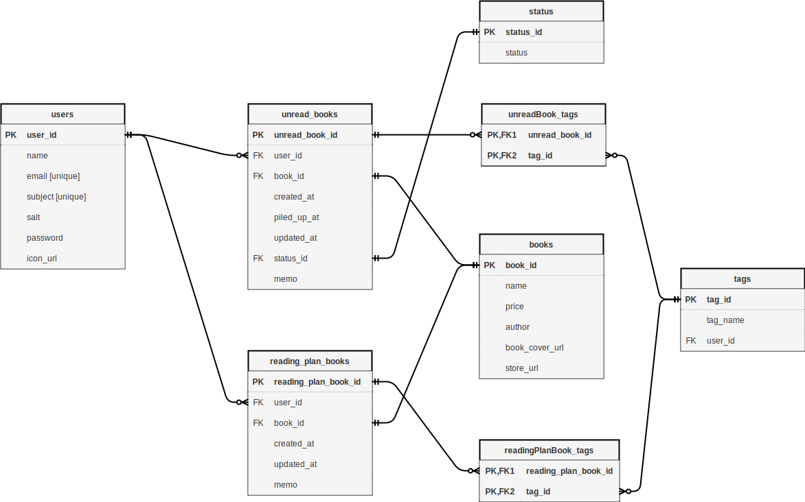

# 積ん読

## 機能

- 自分が積んでいる本の一覧を出す
- 本を積む
- 積んでる本をタグで分類
- いくら積んで、いくら損してるのかをグラフ表示
- ログイン機能
- 消化率とか

### 今後やりたいこと

- 読みたい本のメモ機能
- ページネーション

## Docs



##　ローカル環境での実行方法

1. `tsundoku`という名前の DB がローカルに存在しないことを確認
2. `psql -f script/create_database.sql`を実行
3. .env ファイルを`backend`直下に作成、以下のテンプレートを必要に応じて編集する

```.env
DB_USER=user
DB_PASSWORD=
DB_NAME="tsundoku"
DB_HOST=127.0.0.1
JWT_SECRET="test"
```

4. `pnpm backend migrate`の実行
5. `pnpm backend generateApiType`の実行
6. `pnpm backend dev`を実行し、express を起動

7.
